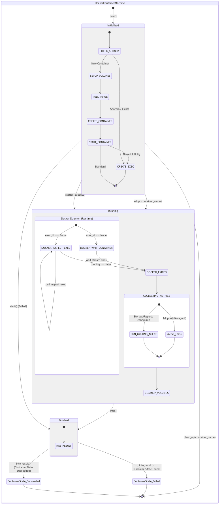

# stormchaser-runner-docker

Docker-specific executor for Stormchaser, managing Docker container lifecycles for distributed workflow step execution.

## State Machine

The runner utilizes a strict Rust Typestate machine to govern the lifecycle of a Docker Container and its integration with the Docker Engine API.

---

## About Stormchaser

Stormchaser is a robust, distributed workflow engine for event-driven and human-triggered workflows. Built in Rust for performance and reliability, it utilizes a graph-based DSL, NATS JetStream for event messaging, and PostgreSQL for state management.

For more information, full documentation, and examples, please visit the [Stormchaser GitHub Repository](https://github.com/paninfracon/stormchaser) and read the [Main Project README](https://github.com/paninfracon/stormchaser/blob/trunk/README.md).
