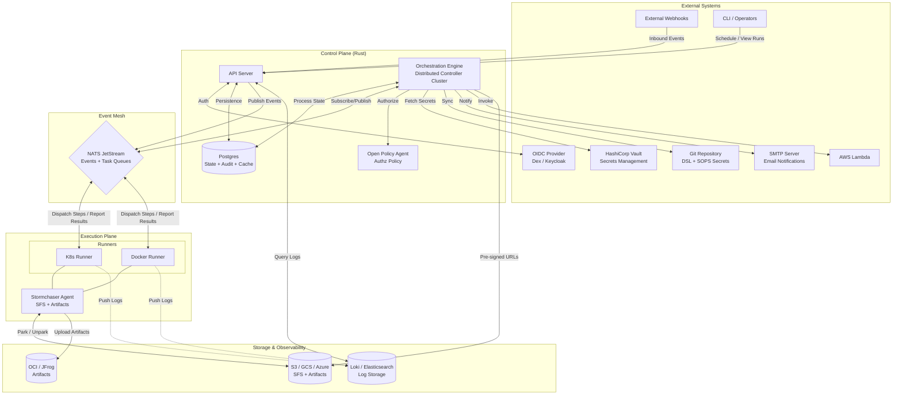

# Stormchaser Architecture

This document describes the high-level architecture of the Stormchaser workflow engine.

## System Diagram

## Triggering & Scheduling

Stormchaser supports multiple trigger mechanisms: manual (API/CLI), event-driven (Webhooks), and scheduled (Cron).

### 1. CronWorkflows

Scheduled execution is handled by registering workflows with an **external cron engine**, avoiding the need for the Stormchaser core to maintain a persistent timer loop.

* **Registration**: When a workflow with a `cron` attribute is submitted, the API registers it in the `cron_workflows` table and, if configured, creates a resource in an external engine (e.g., a Kubernetes `CronJob`).
* **Security**: Each cron schedule is assigned a unique `secret_token`. The external engine is configured to hit a secured webhook endpoint (`POST /api/v1/cron-trigger/:id`) using an `Authorization: Bearer` header containing this token.
* **Pluggable Engines** (Configured via `CRON_ENGINE`):
  * **Kubernetes**: Automatically creates a `CronJob` resource in the cluster that uses `curl` to trigger the API.
  * **Ofelia**: Creates a dummy Docker container with `ofelia.*` labels. Ofelia (running as a separate container) detects these labels and schedules a `job-run` to trigger the API.
  * **None**: The system stores the schedule and token, but registration is left to the user.
* **Identity**: Runs triggered by cron are initiated by the system identity `system:cron`.

See [Workflow DSL](workflow_dsl.md) for details on specifying cron schedules in `.storm` files.

## Component Roles

### 1. Control Plane

* **API Server:** Handles inbound requests from the CLI and Webhooks. It
    performs authentication/authorization and manages the initial "Run"
    creation in PostgreSQL. It also provides a **Storage Backend Registry** API
    for configuring S3, OCI, and JFrog destinations.
* **Orchestration Engine (Controller):** A distributed Rust application that
    manages the workflow state machine. To ensure high availability and data
    consistency, it employs a **Sticky Sharding** model:
  * **SFS Coordination (Parking):** When a step requiring `storage` is
        scheduled, the Controller:

        1. Identifies the default SFS storage backend (S3-compatible).
        2. Generates short-lived **Pre-signed URLs** for both GET (unparking)
            and PUT (parking) operations.
        3. Retrieves the **Cryptographic Hash** (SHA-256) of the last parked
            state for that storage volume in the current run.
        4. Injects these URLs and the expected hash into the task dispatched to
            the Runner.

  * **DSL Transformation Engine:** Before execution, the Controller parses the
        `stormchaser_dsl_version`. If the version is older than the current
        engine's canonical version, it applies a series of AST-to-AST
        transformations to map the old schema to the modern execution model. A
        `DSL_DEPRECATED` warning is logged to the workflow's run history.
  * **Async Step Handling (WaitForEvent):** When a workflow enters a wait
        state:

        1. **State Persistence:** The Controller persists the run's state and a
            set of "Expected Correlation Keys" in the DB.
        2. **Event Matching:** Incoming NATS events are matched against these
            keys.
        3. **Multi-Approval Logic:** For steps with `require_approvals > 1`:

            * The Controller maintains an **Approval Registry** (a list of
                unique `user_id` values from the matched events).
            * Each incoming event is de-duplicated by identity.
            * The `on_partial` block is executed for each valid approval that
                doesn't reach the threshold.
            * The workflow only proceeds to the `next` step once the
                `require_approvals` threshold is reached.

        4. **Identity Validation:** If `approvers` are defined in the DSL, the
            Controller performs a policy check (via OPA or a built-in provider)
            to ensure the event's `user_id` belongs to the authorized list or
            group.
        5. **Rejection Handling:** If an event matching the `on_reject`
            condition arrives, the step is immediately terminated, and the
            rejection logic is triggered.

  * **Subject-Based Partitioning:** NATS JetStream is configured to
        partition workflow events by `RunID`. Each Controller instance "owns" a
        subset of these partitions using **Durable Pull Consumers**, ensuring
        that all events for a specific workflow are processed reliably and in
        order.
  * **Optimistic Concurrency Control (OCC):** The Controller uses
        version-based OCC for all PostgreSQL state transitions. Every `UPDATE`
        to the workflow state includes a `version = version + 1` clause and a
        `WHERE version = :last_seen_version` check. This prevents "lost
        updates" if a shard rebalances and multiple controllers briefly attempt
        to process the same workflow.
  * **Fencing Tokens:** Every task dispatched to a runner includes a
        monotonically increasing fencing token. If a shard moves to a new
        controller, the token is incremented, and any late-arriving results
        from the previous controller's tasks are rejected to prevent duplicate
        execution.
  * **Step Status History:** The Controller maintains a granular historical
        record of every state transition for every step instance in the
        `step_status_history` table. This provides a high-fidelity audit trail
        of a step's lifecycle (e.g., `Pending` -> `Unpacking SFS` -> `Running`
        -> `Packing SFS` -> `Succeeded`).

* **PostgreSQL:** Stores the "Run Context" (DSL synced from Git), historical
    audit logs, state history, and the current state of every active workflow.
* **Open Policy Agent (OPA):** Used for **Policy as Code** validation. Before
    a workflow execution starts, the Controller queries OPA to ensure the run
    complies with organizational policies (e.g., "no production deployments
    outside of business hours").
  * **Fail-Closed Security Model:** If OPA is configured and unreachable or
        returns an error, the Controller MUST NOT proceed with the workflow.
        Inability to validate policy is treated as a hard failure, as execution
        without policy enforcement is a critical security risk. Admission of a
        run will be rejected with a `PolicyProviderUnavailable` error.

### 2. Event Mesh (NATS)

* **JetStream:** Provides the persistent backbone for the event-driven
    architecture. It ensures that no events or step-tasks are lost even if a
    controller or runner restarts. Task scheduled events are stored in the
    `stormchaser` stream.
* **Durable Consumers:** Runners use durable pull consumers (e.g.,
    `docker-runner`, `k8s-runner`) to retrieve tasks. This allows the NATS
    server to track which messages have been delivered and acknowledged,
    enabling automatic redelivery if a runner fails during a task.
* **Task Queues:** Used to distribute workflow steps to the appropriate
    execution engines based on their type (e.g., a "RunContainer" task is pulled
    by the Docker or K8s runner).

### 3. Execution Plane

* **Runners:** Lightweight agents (or sidecars) that consume tasks from NATS
    JetStream, provision the required environment (Container, Lambda, etc.),
    execute the step logic, and report results (including output variables) back
    to NATS.
* **Reliability:** By using JetStream pull consumers, runners can be safely
    restarted or scaled. Pending tasks will remain in the stream until a runner
    becomes available to process them.
* **Runner Lifecycle & Heartbeats:**

    1. **Registration:** When a runner starts, it registers with the Control
        Plane via a NATS `runner.register` event, including its capabilities
        (e.g., "docker", "k8s").
    2. **Heartbeats:** Runners publish periodic heartbeats (e.g., every 10s) to
        a dedicated NATS stream.

* **Liveness Monitoring & Zombie Detection:**

    1. **Step-Level Heartbeats:** In addition to runner-level heartbeats, every
        active task (especially in `locked` affinity) MUST emit a per-task
        heartbeat.
    2. **Dead-Man-Switch:** If the Controller does not receive a per-task
        heartbeat within its `liveness_threshold` (e.g., 60s), it enters
        **Zombie Investigation**:

        * The Controller queries the Runner for the specific task status.
        * If the Runner is unreachable or cannot confirm the task is still
            executing, the Controller marks the task as `lost_zombie` and
            initiates failure logic.

    3. **Static Composition Watchdog:** For `locked` groups (where multiple
        steps run in one Pod/Task), the Runner Agent acts as a watchdog. If the
        command for the current step hangs without resource consumption or
        progress, the Agent signals a `SIGABRT` to the process group to ensure
        a clean failure rather than a silent hang.
    4. **Execution Engine Variability:** The precision of zombie detection
        (e.g., process-level signal monitoring vs. container-level liveness
        probes) is dependent on the execution engine's capabilities. A
        K8s-based runner can provide granular signal propagation, whereas a
        serverless or "Push" model runner (like Lambda) may only support
        aggregate timeouts as a proxy for zombie detection.

### 4. Distributed Consistency & Persistence

Stormchaser ensures reliable state transitions through a combination of
PostgreSQL and NATS JetStream:

1. **Atomic State Updates:** Every state transition (e.g., Step completion) is
    performed within a single Postgres transaction.
2. **Persistent Event Publication:** Orchestration events are published to
    NATS JetStream. While direct publication is used, the use of JetStream
    ensures that once a message is accepted by the NATS cluster, it is durably
    stored until consumed and acknowledged by all relevant subscribers.
3. **Historical Audit Trail:** All granular state changes are recorded in the
    `step_status_history` table, allowing for reconstruction of the execution
    timeline even after a run is archived.

### 5. GitOps & Secrets

* **Git Sync:** A background process within the controller that ensures the
    PostgreSQL DSL cache is up to date with the Git repository.
* **SOPS & Secret Lifecycle:**

    1. **System Startup:** The Control Plane and Execution Plane decrypt
        infrastructure-level secrets (DB, NATS, KMS keys) via SOPS once at
        startup.
    2. **Workflow Initiation:** When a workflow is triggered, the Controller
        decrypts the SOPS-encrypted secrets defined in the DSL for that
        specific run.

3. **Persistence:** These decrypted secrets are then stored in the PostgreSQL
    "Run State" (encrypted at rest using the system's Master Key).
4. **Step Injection:** Subsequent steps within the workflow retrieve these
    secrets directly from the database, eliminating the need for repeated
    SOPS tool calls and preventing a CPU bottleneck during high-concurrency
    execution.

* **Secret Masking:** To prevent accidental leakage of sensitive information,
    the Control Plane maintains a "Sensitive Values Registry" for each active
    run.

    1. **Registry Sources:** The registry is populated from static DSL-defined
        secrets, outputs marked as `sensitive = true`, and dynamic
        `::add-mask::` commands sent by runners.
    2. **Loki Redaction:** All logs emitted by runners are intercepted by the
        Loki-integrated log-shipper, which redacts any strings matching the
        registry before they are persisted.
    3. **Real-Time Masking:** The Runner Agent performs real-time redaction on
        the local log stream immediately after a new mask is registered via
        `::add-mask::`, ensuring even the current step's subsequent logs are
        safe.

### 6. Resource Quota Enforcement

Stormchaser maintains multi-tenant stability through a distributed quota
management system:

1. **Quota Tracking:** The Control Plane tracks the "In-Flight Resource
    Consumption" for every active run in PostgreSQL.
2. **Validation (Pre-Execution):** Before initiating a run, the Controller
    verifies that the requested `quotas` comply with the organizational policy
    stored in OPA.
3. **Active Enforcement:**

    * **Concurrency Limits:** The Controller uses NATS JetStream "pull
        consumers" with backpressure. If a run's `max_concurrency` reached, the
        Controller stops pulling new tasks for that RunID until active steps
        complete.
    * **Resource Monitoring:** If the aggregate CPU/Memory request of active
        steps exceeds `max_cpu` or `max_memory`, the Controller pauses task
        dispatch.
    * **Storage Quotas:** The Shared File System (SFS) provisioner monitors
        the size of the underlying volume (e.g., EBS/EFS). If a step attempts
        to write beyond the `max_storage` limit, the write fails, and the step
        is terminated with a "Resource Quota Exceeded" error.
    * **I/O Throughput Throttling:** To prevent "Noisy Neighbor" scenarios on
        shared infrastructure:

        1. **Enforcement:** The Runner Agent uses OS-level control groups
            (e.g., Linux `blkio` cgroup) to cap the `max_throughput` and
            `max_iops` defined in the DSL's `storage.limits` block.
        2. **Monitoring:** The Agent publishes periodic I/O utilization
            metrics to NATS.

    * **Execution Engine Variability:** Note that the enforcement of these
        quotas (especially I/O throttling and granular CPU/Memory caps) is
        dependent on the capabilities of the underlying execution engine. For
        example, a K8s runner may support strict cgroup-based throttling,
        whereas a Lambda or ECS-Fargate runner may only support aggregate
        timeouts or predefined resource tiers.

4. **Graceful Termination:** If a run exceeds its `timeout` quota, the
    Controller sends an `abort` signal to all active runners and initiates the
    `on_failure` or `finally` cleanup blocks.

### 7. Housekeeping & Data Retention

To prevent storage exhaustion in PostgreSQL and NATS JetStream, the Control
Plane implements an automated **Retention Policy Engine**:

1. **Global Retention Period:** By default, all workflow "Run State"
    (decrypted secrets, step outputs, and NATS event streams) is retained for
    **30 days**. This is configurable at the organizational or workflow level.
2. **NATS Stream Cleanup:** Once a workflow reaches a terminal state
    (`Succeeded`, `Failed`, or `Aborted`) and its grace period expires, the
    Controller issues a `DeleteStream` command to NATS JetStream for all
    streams scoped to that `RunID`.
3. **Postgres Archiving:**

    * **Audit Logs:** High-level metadata (who ran what, when, and the final
        status) is moved to a "Long-term Audit" table and kept indefinitely
        (or according to compliance rules).
    * **Execution Detail:** Granular step logs, large JSON outputs, and
        intermediate state are hard-deleted from the primary DB after the
        retention period.

4. **SFS Decommissioning:** Any "Parked" file system bundles (tarballs in
    S3/GCS) are deleted unless explicitly marked for long-term storage in the
    DSL `artifacts` block.

### 8. Runner Protocol Versioning & Compatibility

To ensure stable communication between the Control Plane and a distributed fleet
of Runners, the system employs **Semantic Protocol Versioning**:

1. **Handshake:** During the `runner.register` NATS event, the Runner MUST
    include its `protocol_version` (e.g., `1.2.0`).
2. **Compatibility Check:** The Controller maintains a
    `min_supported_protocol_version`.

    * If a Runner's version is lower than the minimum, registration is
        rejected with a `VersionMismatch` error, and the Runner is blocked from
        receiving tasks.
    * If a Runner is within the supported range but older than the
        Controller, the Controller may emit a `RunnerDeprecated` warning in the
        system audit log.

3. **Feature Negotiation:** The Controller only dispatches tasks to Runners
    that advertise the required capabilities (e.g., "docker-v20",
    "sops-support") for that specific step.

### 9. Performance Tuning & Scalability

Stormchaser is designed to handle high-concurrency workloads through targeted
architectural optimizations:

1. **Outbox Relay Optimization:**

    * **High-Frequency Polling:** The Outbox Relay process uses a
        sub-millisecond polling interval (via `SKIP LOCKED`) to minimize the
        latency between database commit and NATS dispatch.
    * **NATS-Backed Notify:** To further reduce latency, the Controller can
        issue a "NATS Notify" signal immediately after a DB commit, prompting
        the relay to poll the outbox instantly rather than waiting for the
        next polling cycle.

2. **Shard Rebalancing Storm Mitigation:**

    * **Graceful Handoff:** When a shard moves between Controller nodes, the
        system uses a **Staggered Reclamation** strategy. The new owner node
        "warms up" by loading the run context from Postgres before assuming
        control of the NATS consumer.
    * **Exponential Backoff:** During high-traffic rebalancing events, the
        Controller applies exponential backoff to internal state transitions to
        prevent "Thundering Herd" pressure on the PostgreSQL instance.
    * **Event Buffering:** NATS JetStream acts as a buffer. During a shard
        transition, events remain in the stream and are only consumed once the
        new shard owner is fully ready and has validated the latest fencing
        tokens.

### 10. Affinity Implementation Strategies

Stormchaser employs two distinct strategies to realize the performance and
isolation guarantees of its affinity levels:

#### A. Static Composition (for `locked` affinity)

When a group of steps is marked as `locked`, the Control Plane performs
**Pre-Dispatch Synthesis**:

* **Single Pod/Task:** The Controller generates a single runner manifest
    (e.g., a K8s Pod or ECS Task).
* **Sequential Execution:** Steps are mapped to sequential commands within
    the same container or as a series of Init Containers sharing a common
    `emptyDir` volume.
* **Lifecycle:** The runner is ephemeral and terminates immediately upon the
    completion of the final step in the locked group.

#### B. Dynamic Orchestration (for `shared` affinity)

To achieve the 30-50% performance optimization for `shared` steps, the system
uses a **Warm Runner Agent**:

* **Persistent Environment:** The Controller dispatches a specialized
    "Stormchaser Runner Agent" to the execution plane.
* **Implicit Context Purge (Soft Reset):** Between every step in a shared
    environment, the Agent MUST perform a "Soft Reset":

    1. **Reap:** SIGKILL all processes in the current cgroup/namespace,
        **except** for the Agent itself and any processes matching the
        `process_allow_list` defined in the workflow strategy.
    2. **Sanitize:** Wipe all non-system environment variables.
    3. **Wipe:** Clear `/tmp`, `/var/tmp`, and any other ephemeral scratch
        spaces.

* **Command Streaming:** Instead of terminating after one step, the Agent
    remains active and "pulls" subsequent steps from NATS that share the same
    affinity context.
* **Image Caching:** The Agent maintains a local cache of container images
    and execution layers, eliminating the "cold start" overhead for sequential
    tasks using compatible runtimes.
* **Cleanup:** The Agent is strictly bound to the **Workflow Execution
    Boundary** and is automatically decommissioned by the Controller once the
    associated workflow completes.

## Runner Feature Comparison

Stormchaser provides specialized runners for different execution environments.
While all runners aim for a consistent execution model, some features are
specific to the underlying runtime capabilities.

### Comparison Table

| Feature | K8s Runner (`RunK8sJob` / `RunContainer`) | Docker Runner (`RunContainer`) |
| :--- | :--- | :--- |
| **Shared File System (SFS)** | ✅ Full (Init Containers + Agent) | ✅ Full (Sequential Containers + Agent) |
| **Orphan Adoption** | ✅ Full (Startup scan + Orchestrator sync) | ✅ Full (Startup scan + Orchestrator sync) |
| **Metadata Encryption** | ✅ AES-256-GCM (Annotations) | ✅ AES-256-GCM (Labels) |
| **Resource Limits** | ✅ CPU/Memory Requests & Limits | ✅ CPU Quota & Memory Bytes |
| **Privileged Mode** | ✅ Supported | ✅ Supported |
| **Garbage Collection** | ✅ 24h Background Reaper | ✅ 24h Background Reaper |
| **SFS Consistency Checks** | ✅ SHA-256 Hash Verification | ✅ SHA-256 Hash Verification |
| **Artifact & Test Reports** | ✅ Log-based Ingest | ✅ Log-based Ingest |
| **Secret/ConfigMap Mounts** | ✅ K8s Native | ❌ Not Supported |
| **Advanced Scheduling** | ✅ Parallelism/Completions | ❌ Not Supported |

### Feature Explanations

#### 1. Shared File System (SFS) & Artifacts

Both runners implement the **Park/Unpark** model. Before a step starts, they
"unpark" (download and extract) any required storage volumes from the SFS
backend. After the step completes successfully, they "park" (compress and
upload) the modified files and report the new SHA-256 hash back to the
orchestrator.

#### 2. Orphan Adoption & Recovery

To ensure high availability, both runners scan for "orphaned" tasks upon startup
(e.g., after a runner crash or restart). They identify containers managed by
Stormchaser, verify their current status with the Orchestration Engine via
NATS, and "adopt" them to continue monitoring their lifecycle and reporting
results.

#### 3. Metadata Encryption

Sensitive step data (the DSL and state) stored in container metadata (K8s
Annotations or Docker Labels) can be encrypted using **AES-256-GCM**. This
prevents sensitive information from being visible to users with only
container-runtime-level access (e.g., `kubectl describe` or `docker inspect`).

#### 4. Resource Isolation

* **Kubernetes**: Uses native `requests` and `limits` for CPU and Memory,
    allowing for granular scheduling and OOM protection.
* **Docker**: Implements CPU isolation via `CpuQuota` (CFS quota) and Memory
    isolation via byte limits.

#### 5. Garbage Collection (Reaper)

Both runners include a background "reaper" process that periodically cleans up
stale resources (containers and metadata) older than 24 hours. This ensures
that even in the event of catastrophic failures where standard cleanup logic
fails, the runner host does not suffer from resource exhaustion over time.

### Parallelism and Scheduling Models

A key distinction between the K8s and Docker runners is where the logic for
parallel execution resides.

#### 1. Native Runtime Scheduling (K8s Only)

When using `RunK8sJob`, Stormchaser offloads the scheduling logic to the
Kubernetes Job Controller. This is "Advanced Scheduling" where a single
Stormchaser step instance maps to a single K8s Job that internally manages
multiple Pods to reach a completion goal.

#### 2. Workflow-Level Orchestration (Runner Agnostic)

For both Docker and Kubernetes runners, Stormchaser provides sophisticated
parallelism via the **Workflow Engine's `iterate` strategy**.

* **Fan-Out**: The Orchestration Engine evaluates the iteration list and
    creates multiple independent `step_instances` in the database.
* **Independent Dispatch**: Each iteration is dispatched as a separate NATS
    task (`RunContainer`).
* **Parallel Execution**: The Docker runner naturally executes these tasks in
    parallel using its internal async task pool.
* **Concurrency Control**: The Engine enforces `max_parallel` (per step) and
    `max_concurrency` (per workflow) before dispatching tasks to any runner.

**Conclusion**: Users can achieve high-performance parallel execution in
Docker-only environments by using the engine's native iteration logic, which
provides feature parity with Kubernetes' advanced scheduling for most common
use cases.
