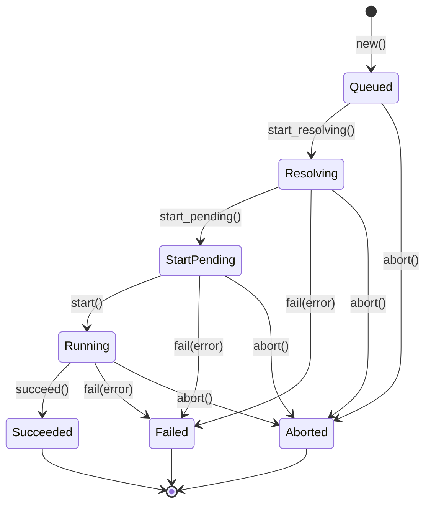
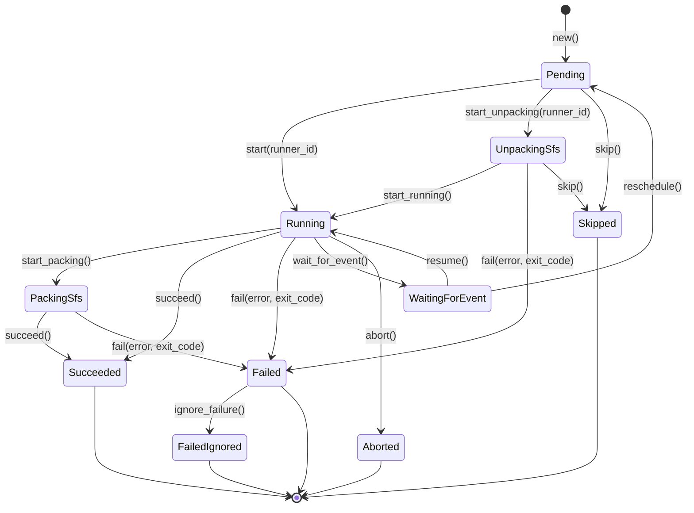

# Stormchaser State Machines

## Workflow State Machine

```mermaid
stateDiagram-v2
    [*] --> Queued: new()

    Queued --> Resolving: start_resolving()
    Queued --> Aborted: abort()

    Resolving --> StartPending: start_pending()
    Resolving --> Failed: fail(error)
    Resolving --> Aborted: abort()

    StartPending --> Running: start()
    StartPending --> Failed: fail(error)
    StartPending --> Aborted: abort()

    Running --> Succeeded: succeed()
    Running --> Failed: fail(error)
    Running --> Aborted: abort()

    Succeeded --> [*]
    Failed --> [*]
    Aborted --> [*]
```

## Step State Machine

```mermaid
stateDiagram-v2
    [*] --> Pending: new()

    Pending --> Running: start(runner_id)
    Pending --> UnpackingSfs: start_unpacking(runner_id)
    Pending --> Skipped: skip()

    UnpackingSfs --> Running: start_running()
    UnpackingSfs --> Failed: fail(error, exit_code)
    UnpackingSfs --> Skipped: skip()

    Running --> PackingSfs: start_packing()
    Running --> Succeeded: succeed()
    Running --> Failed: fail(error, exit_code)
    Running --> WaitingForEvent: wait_for_event()
    Running --> Aborted: abort()

    PackingSfs --> Succeeded: succeed()
    PackingSfs --> Failed: fail(error, exit_code)

    WaitingForEvent --> Running: resume()
    WaitingForEvent --> Pending: reschedule()

    Failed --> FailedIgnored: ignore_failure()

    Succeeded --> [*]
    Skipped --> [*]
    Failed --> [*]
    FailedIgnored --> [*]
    Aborted --> [*]
```
